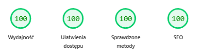

# 📚 KolejnośćKsiążek.pl

Polish-language static website that helps readers find the correct reading order for popular book series. Each series page shows books in chronological order with original and Polish publication years, book types, and frequently asked questions.

**Live site:** [kolejnoscksiazek.pl](https://kolejnoscksiazek.pl)

## ✨ Features

- **10 book series** with full reading order (Wiedźmin, Harry Potter, Władca Pierścieni, Pieśń Lodu i Ognia, Świat Dysku, Diuna, Cykl Fundacji, Ziemiomorze, Igrzyska Śmierci, Zmierzch)
- **Full-text search** powered by Pagefind with Polish language support
- **Author pages** — browse all series by a given author
- **Genre pages** — discover series by genre (fantasy, sci-fi, dystopia, etc.)
- **SEO optimized** — JSON-LD structured data (BreadcrumbList, ItemList, FAQPage), Open Graph & Twitter Card meta tags, sitemap, robots.txt
- **Accessible** — semantic HTML, breadcrumb navigation, keyboard-friendly FAQ accordions

## 🛠 Tech Stack

| Technology | Purpose |
|---|---|
| [Astro](https://astro.build/) 6.4 | Static site generation |
| [Tailwind CSS](https://tailwindcss.com/) v4 | Styling |
| [Pagefind](https://pagefind.app/) | Client-side search |
| [TypeScript](https://www.typescriptlang.org/) | Type safety |
| [Vercel](https://vercel.com/) | Hosting & deployment |

## ⚡ PageSpeed Insights

<!-- Paste PageSpeed Insights screenshots below -->

| Mobile |
|---|
|  |
## 🚀 Getting Started

### Prerequisites

- **Node.js** >= 22.12.0

### Installation

```bash
# Clone the repository
git clone https://github.com/rafalwizen/books-in-order.git
cd books-in-order

# Install dependencies
npm install

# Start dev server
npm run dev
```

### Available Scripts

| Command | Action |
|---|---|
| `npm run dev` | Start local dev server at `localhost:4321` |
| `npm run build` | Build production site to `./dist/` |
| `npm run preview` | Preview build locally before deploying |

## 📁 Project Structure

```
books-in-order/
├── public/                  # Static assets (favicon, robots.txt)
├── src/
│   ├── components/          # Reusable UI components
│   │   ├── BookList.astro   # Ordered book list with badges
│   │   ├── Breadcrumbs.astro
│   │   └── FAQ.astro        # Expandable FAQ accordion
│   ├── content/
│   │   └── series/          # JSON files with book series data
│   ├── pages/               # File-based routing
│   │   ├── index.astro      # Homepage
│   │   ├── [slug].astro     # Series detail page
│   │   ├── autorzy/[slug].astro  # Author pages
│   │   ├── gatunki/[slug].astro  # Genre pages
│   │   └── szukaj.astro     # Search page
│   ├── utils/
│   │   ├── seo.ts           # JSON-LD structured data generators
│   │   └── series.ts        # Series query helpers
│   ├── content.config.ts    # Content collection schema
│   └── layouts/             # Page layouts
├── astro.config.mjs
├── tailwind.config.mjs
└── package.json
```

## 📄 License

This project is for educational and personal use.
